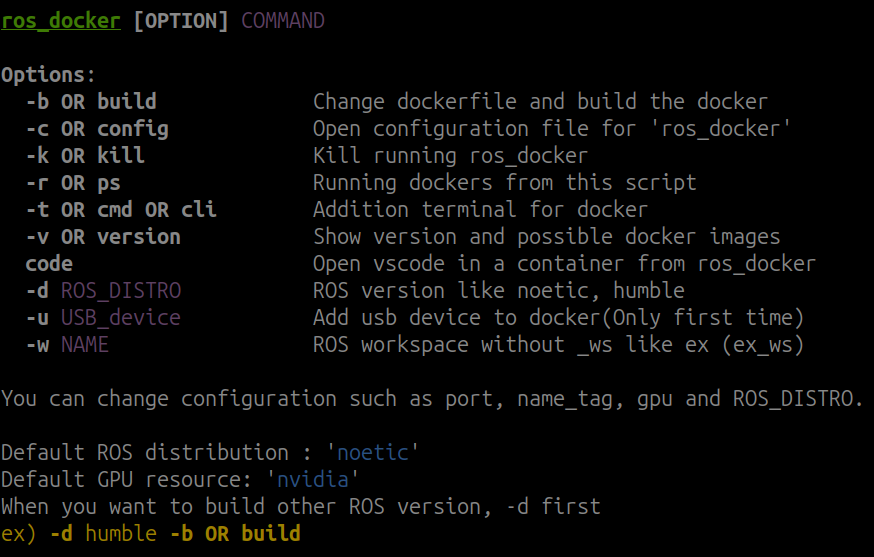

# ros_docker
Bash script for ROS with docker

  with  written in 
<br/>
<br/>
<br/>

# How it looks like


<br/>

# Getting Started
### Clone this repo.
```bash
git clone https://github.com/mars-hss/ros_docker.git
```
### Execute install script.
#### (*sudo permission is later for asking password.)
```bash
cd path-to-clone/ros_docker/
bash ./install.sh
```

### Find out more details [Wiki](https://github.com/mars-hss/ros_docker/wiki)

<br/>

## File structure
```
ROS(Or your specific)
  ┃
  ┣ intel                     "Dockerfile for intel or AMD"
  ┣ nvidia                    "Dockerfile for Nvidia"
  ┃  
  ┣ noetic                    "ROS 1 noetic"
  ┃   ┣ test_ws               "ROS noetic workspace called test"
  ┃   ┣ ...
  ┃
  ┣ humble                    "ROS 2 humble"
  ┃   ┣ test_ws               "ROS humble workspace called test"
  ┃   ┣ ...
  ┃
```
